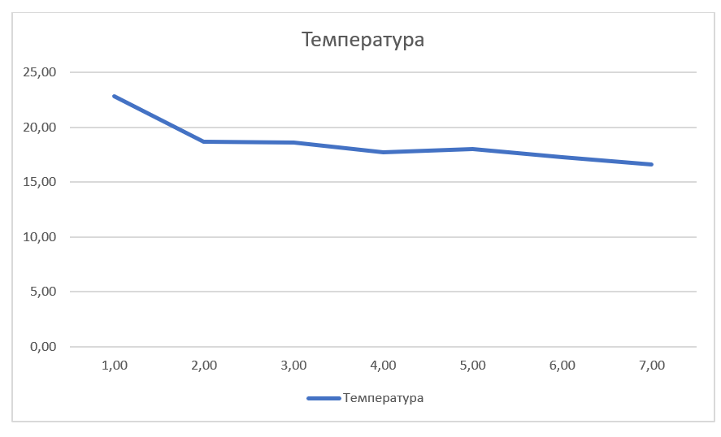
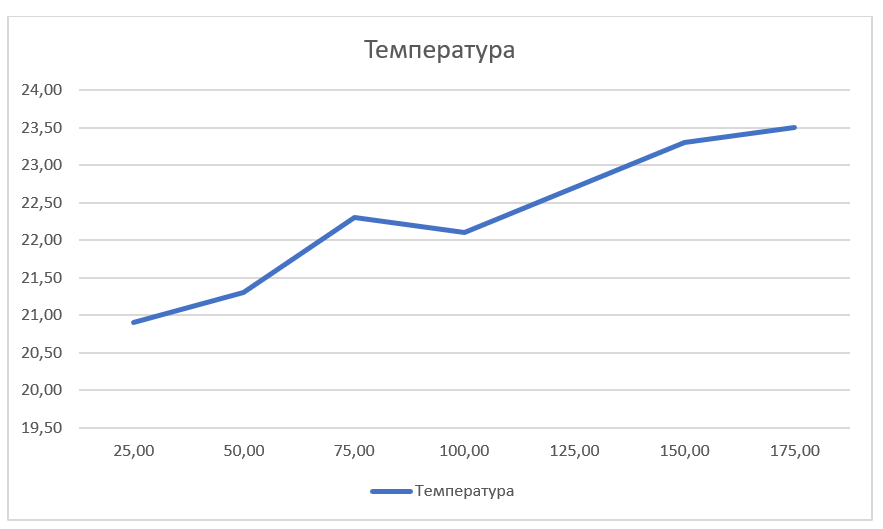
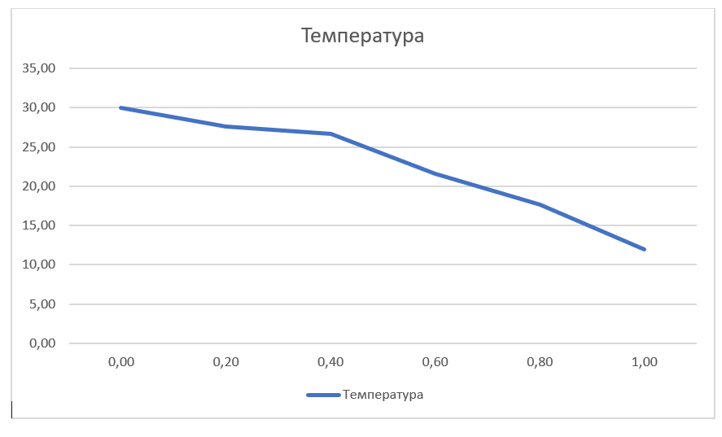

## Комп'ютерні системи імітаційного моделювання
## СПм-22-4, **Павлов Олександр Сергійович**
### Лабораторна робота №**1**. Опис імітаційних моделей та проведення обчислювальних експериментів

 

### Варіант 2, модель у середовищі NetLogo:
[Climate Change](http://www.netlogoweb.org/launch#http://www.netlogoweb.org/assets/modelslib/Sample%20Models/Earth%20Science/Climate%20Change.nlogo)

### Вербальний опис моделі:

Ця модель імітує потік енергії на Землі, враховуючи вплив сонячного світла, хмар і парникових газів. Це інтерактивна візуалізація кліматичних процесів, де можна експериментувати з різними факторами для спостереження змін у температурі Землі.

### Керуючі параметри:
- **sun-brightness** цей параметр регулює інтенсивність сонячного випромінювання, що потрапляє на Землю.
- **albedo** вказує, наскільки поверхня Землі відбиває світло. Високий альбедо свідчить про велике відбивання сонячної енергії.
- **add-cloud** цей параметр визначає можливість додавання хмар до атмосфери моделі. Хмари можуть впливати на відбиття сонячної енергії та блокування інфрачервоного випромінювання.
- **add-CO2** дозволяє додавати молекули діоксиду вуглецю (CO2) до атмосфери моделі. Кожного разу додається 25 молекул.

### Внутрішні параметри:
- **sky-top** визначає вертикальну координату верхнього рядка неба в моделі.
- **earth-top** визначає вертикальну координату верхнього рядка Землі в моделі і вказує на межу між поверхнею Землі та атмосферою.
- **temperature** представляє загальну температуру Землі в моделі, відображаючи стан теплової енергії на планеті та заснований на кількості червоних точок в моделі.
### Показники роботи системи:
- Графік глобальної температури на планеті протягом усього періоду симуляції.
- Монітор поточного значення температури в данний момент.
- Монітор поточної кількість CO2 в атмосфері.

### Примітки:
Спостереження за променем світла в моделі виявляє цікаву динаміку. Коли промінь світла торкається Землі, на основі принципів моделі розгортається кілька сценаріїв. Якщо сонячне світло поглинається Землею, воно перетворюється на червону крапку, що символізує теплову енергію. Потім ці червоні точки безладно рухаються під грунтом, впливаючи на температуру планети. Деякі з цих червоних точок інколи перетворюються на інфрачервоне (ІЧ) світло, представлене пурпуровими стрілками. ІЧ-світло спрямовується в космос, виносячи енергію. Імовірність того, що червона точка стане ІЧ-світлом, залежить від температури Землі, причому при вищих температурах відбувається більше перетворень. ІЧ-проміння може проходити крізь хмари, але може відбиватися від молекул CO2. 
  
### Недоліки моделі:
Модель розглядає "пласку", так би мовити, реальність світу. Для поліпшення реалізму моделі, можна додати фактори, такі як динаміка рослинності або змінне альбедо для окремих областей, наприклад, льодовики з високим альбедо та моря з низьким альбедо, щоб відобразити взаємозв'язки, які доповнюють загальні закони енергетики. Також варто відзначити відсутність в моделі зміни дня та ночі, хоча це важливий фактор для реального глобального теплового рівноваги. 

## Обчислювальні експерименти
### 1. Вплив кількості хмар на температуру
Досліджується вплив кількості хмар на температуру землі. Кількість тактів - 1500.
Експерименти проводяться при 1-7 хмарах, з кроком 1, усього 7 симуляцій.  
Інші керуючі параметри мають значення за замовчуванням:
- **sun-brightness**: 1.0
- **albedo**: 0.6
- **CO2 amount**: 0

<table>
<thead>
<tr><th>Кількість хмар</th><th>Температура</th></tr>
</thead>
<tbody>
<tr><td>1</td><td>22,8</td></tr>
<tr><td>2</td><td>18,7</td></tr>
<tr><td>3</td><td>18,6</td></tr>
<tr><td>4</td><td>17,7</td></tr>
<tr><td>5</td><td>18,0</td></tr>
<tr><td>6</td><td>17,3</td></tr>
<tr><td>7</td><td>16,6</td></tr>
</tbody>
</table>

Графік наочно показує, що зростання кількості хмар призвело до послідовного зменшення температури від 22,8 до 16,6 градусів. Це вказує на те, що хмари виконують роль ефективного блокувальника сонячного випромінювання, знижуючи його вплив на нагрівання поверхні.

### 2. Вплив кількості CO2 в атмосфері на температуру
Досліджується вплив кількості CO2 в атмосфері на температуру Землі.Кількість тактів - 1500.
Експерименти проводяться при 25-175  значеннях CO2 в атмосфері, з кроком 25, усього 7 симуляцій.  
Інші керуючі параметри мають значення за замовчуванням:
- **sun-brightness**: 1.0
- **albedo**: 0.6
- **cloud amount**: 0

<table>
<thead>
<tr><th>Кількості CO2</th><th>Температура</th></tr>
</thead>
<tbody>
<tr><td>25</td><td>20,9</td></tr>
<tr><td>50</td><td>21,3</td></tr>
<tr><td>75</td><td>22,3</td></tr>
<tr><td>100</td><td>22,1</td></tr>
<tr><td>125</td><td>22,7</td></tr>
<tr><td>150</td><td>23,3</td></tr>
<tr><td>175</td><td>23,5</td></tr>
</tbody>
</table>

Графік наочно показує, що за умови фіксованих інших параметрів та зі збільшенням кількості CO2 від 25 до 175 одиниць, спостерігається зростання температури від 20,9 до 23,5 градусів. Це свідчить про той факт, що CO2 в атмосфері є ключовим гравцем у збереженні тепла, відбитого від поверхні Землі.

### 3.  Вплив альбедо на температуру
Досліджується вплив рівня альбедо землі на температуру. Кількість тактів - 1500.
Експерименти проводяться при 0.0-1.0  значеннях альбедо, з кроком 0.2, усього 6 симуляцій.  
Інші керуючі параметри мають значення за замовчуванням:
- **sun-brightness**: 1.0
- **CO2 amount**: 0
- **cloud amount**: 0

<table>
<thead>
<tr><th>Альбедо</th><th>Температура</th></tr>
</thead>
<tbody>
<tr><td>0,0</td><td>30,0</td></tr>
<tr><td>0,2</td><td>27,6</td></tr>
<tr><td>0,4</td><td>26,7</td></tr>
<tr><td>0,6</td><td>21,6</td></tr>
<tr><td>0,8</td><td>27,7</td></tr>
<tr><td>1,0</td><td>12,0</td></tr>
</tbody>
</table>

Графік наочно показує, що поверхня з низьким альбедо, що поглинає більше сонячної енергії, нагрівається швидше, тоді як поверхня з високим альбедо відбиває більше сонячної енергії і залишається холодною. Ці результати акцентують важливість врахування альбедо при моделюванні кліматичних змін та виявляють потенційні вливи змін відбивальності на глобальний температурний режим.
