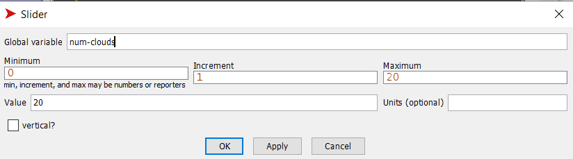
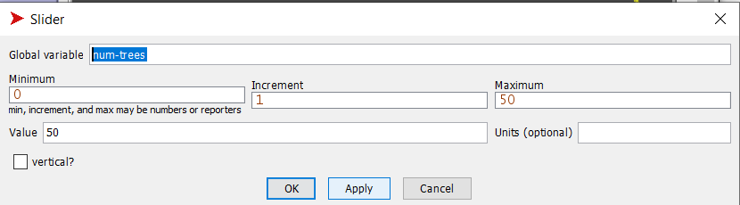
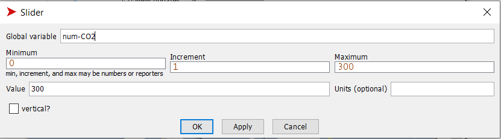
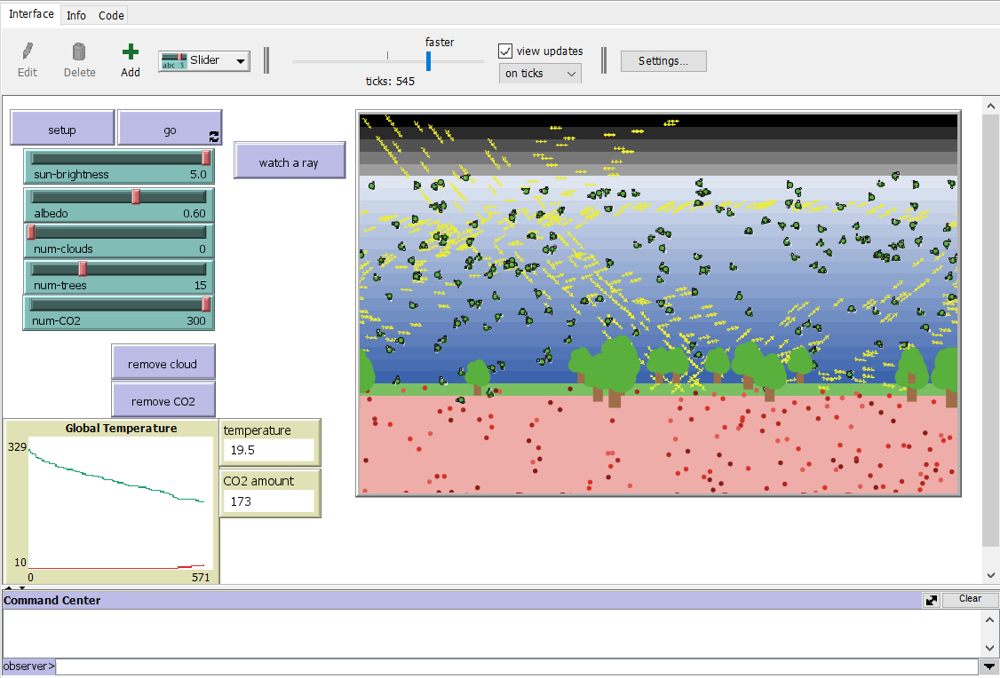
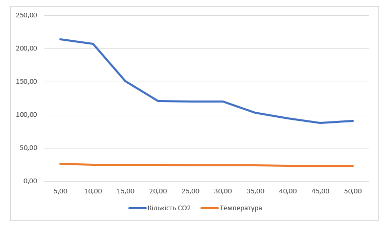

## Комп'ютерні системи імітаційного моделювання
## СПм-22-4, **Павлов Олександр Сергійович**
### Лабораторна робота №**2**. Редагування імітаційних моделей у середовищі NetLogo

 

### Варіант 2, модель у середовищі NetLogo:
[Climate Change](http://www.netlogoweb.org/launch#http://www.netlogoweb.org/assets/modelslib/Sample%20Models/Earth%20Science/Climate%20Change.nlogo)

 

### Внесені зміни у вихідну логіку моделі, за варіантом:

**Додати можливість вказівки початкової кількості хмар.** 

Зміни в процедурі add-cloud. Вона викликає саму себе декілька разів, скільки вкаже користувач, щоб створити достатню кількість хмар:
<pre>
  to add-cloud [num] 
      if num - 1 > 0 [add-cloud num - 1]
      ...
  end
</pre>

Створено слайдер для вказівки кількості хмар - **num-clouds**:

Зміни в процедурі setup-world. Додано виклик функції add-cloud з параметром кількості хмар.
<pre>
to setup-world
  ...
  add-cloud num-clouds
end
</pre>

Видалено кнопку додавання нових хмар. Видалення хмар залишено.

**Додати зміну кута падіння нових сонячних промінів протягом часу (це дозволить імітувати зміну положення сонця протягом доби)**

Зміни в процедурі create-sunshine. Кожні 10 тіків кут променів змінюється на один градус. Кут падіння променів змінюється від 90 градусів до 270.
<pre>
  to create-sunshine
  ...
  set heading 90 + ticks / 10 mod 180
  ...  
end
</pre>

### Внесені зміни у вихідну логіку моделі, на власний розсуд:

**Додати дерева**

Створено нових агентів дерева - tree. Також створену процедуру add-trees, яка працює за схожим принципом з add-clouds.
<pre>
 breed [trees tree]
  
 to add-trees [num]  ;; erase clouds and then create new ones, plus one
  if num - 1 > 0 [add-trees num - 1]
  let sky-height sky-top - earth-top
  let y earth-top + 1
  let x random-xcor
  create-trees 1
  [
    set color green
    set size 3 + random 3
    set heading 90
    setxy x + random 9 - 4
          y + random 2
  ]
end
</pre>

Створено слайдер для вказівки кількості дерев - **num-trees**:

Зміни в процедурі setup-world. Додано виклик функції add-trees з параметром кількості дерев.
<pre>
  to setup-world
  ...
    add-trees num-trees
  end
</pre>

Додано поглинання деревами молекул CO2 з вірогідністю в 10%.
<pre>
to run-CO2
  ...
    let other-tree one-of other trees-on patch-here
    if other-tree != nobody and random-float 100 < 10 [die]
end
      
</pre>

**Додати можливість вказівки початкової кількості CO2**

Змінено процедуру add-CO2. А саме, тепер вона приймає число, яке означає скільки треба створити молекул:
<pre>
  to add-CO2 [num]  ;; randomly adds 25 CO2 molecules to atmosphere
  let sky-height sky-top - earth-top
  create-CO2s num [
    set color green
    ;; pick a random position in the sky area
    setxy random-xcor
          earth-top + random-float sky-height
  ]
end
</pre>

Додано виклик процедури add-CO2 в процедуры setup-world:

<pre> add-CO2 num-CO2 </pre>

Додано слайдер для вказівки початкової кількості CO2:

Видалено кнопку "add CO2".

Також додано графік зміни кількості CO2 в атмосфері.

Фінальний код моделі та її інтерфейс доступні за 
[посиланням](ClimateChange_1.nlogo)

 

## Обчислювальні експерименти 
### 1. Вплив кількості дерев на CO2 і температуру
Досліджується вплив кількості дерев на кількість CO2 в атмосфері і температуру. Кількість тактів - 1000.
Експерименти проводяться при 5-50  дерев, з кроком 5, усього 10 симуляцій.  
Інші керуючі параметри мають значення за замовчуванням:
- **sun-brightness**: 1.0
- **albedo**: 0.6
- **num-clouds**: 0
- **num-CO2**:300

<table>
<thead>
<tr><th>Кількості дерев</th><th>Кількість CO2</th><th>Температура</th></tr>
</thead>
<tbody>
<tr><td>5</td><td>214</td><td>26,4</td></tr>
<tr><td>10</td><td>207</td><td>24,7</td></tr>
<tr><td>15</td><td>151</td><td>24,8</td></tr>
<tr><td>20</td><td>121</td><td>24,5</td></tr>
<tr><td>25</td><td>120</td><td>23,9</td></tr>
<tr><td>30</td><td>120</td><td>24,4</td></tr>
<tr><td>35</td><td>103</td><td>24,2</td></tr>
<tr><td>40</td><td>95</td><td>23,3</td></tr>
<tr><td>45</td><td>88</td><td>23,1</td></tr>
<tr><td>50</td><td>91</td><td>23,1</td></tr>
</tbody>
</table>

Графік наочно показує, що зі збільшенням кількості дерев спостерігається загальне зменшення кількості CO2 в атмосфері та зниження температури. Загалом можна спостерігати тенденцію до зменшення кількості CO2 в атмосфері при збільшенні кількості дерев. Можливо, існує оптимальна кількість дерев, яка максимально ефективно зменшує кількість CO2 і температуру.
