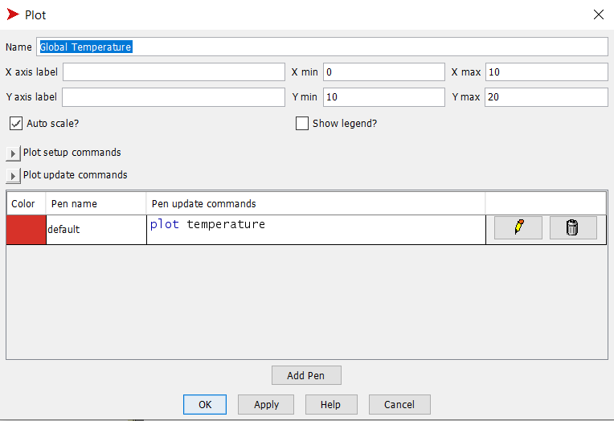
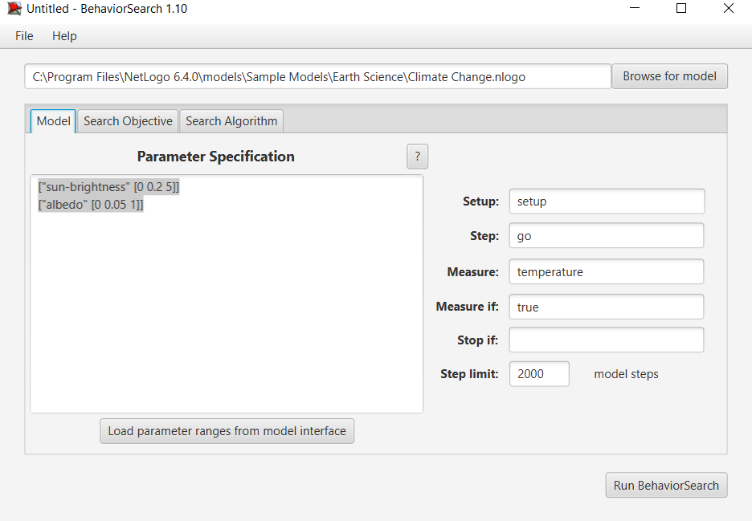
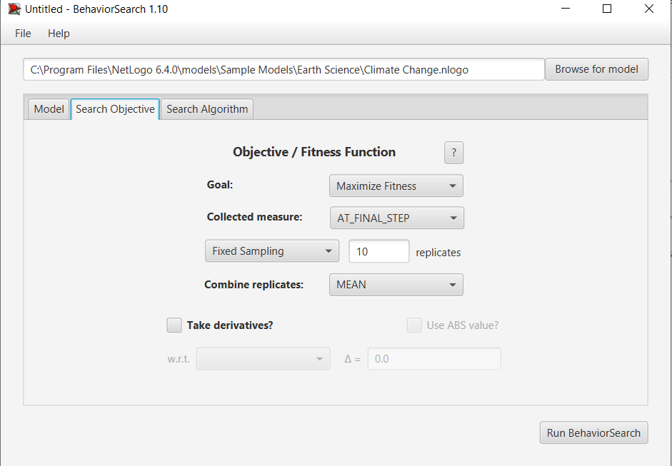
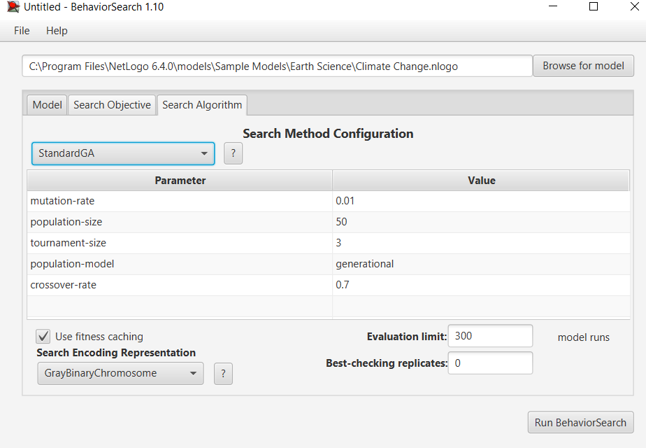
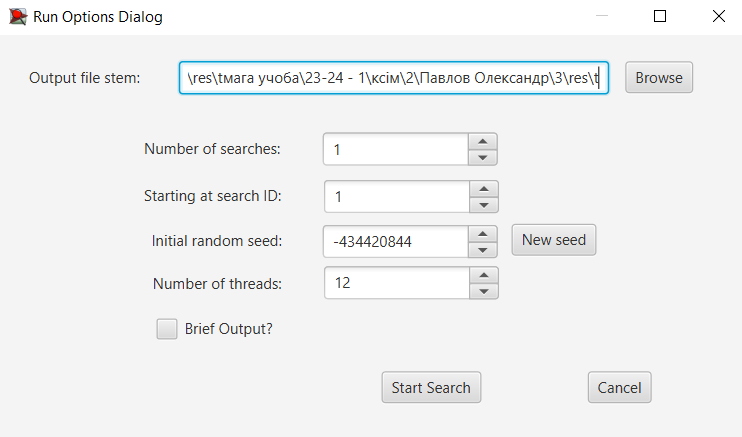
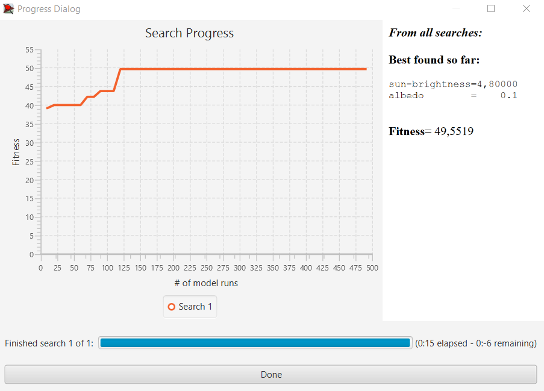
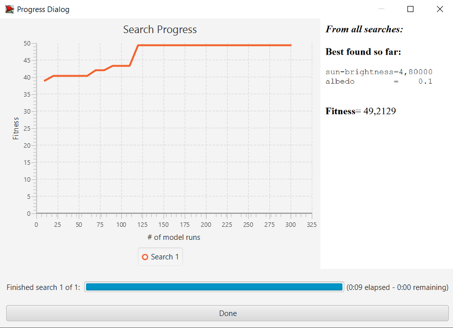

## Комп'ютерні системи імітаційного моделювання
## СПм-22-4, **Павлов Олександр Сергійович**
### Лабораторна робота №**3**. Використання засобів обчислювального интелекту для оптимізації імітаційних моделей

### Варіант 2, модель у середовищі NetLogo:
[Climate Change](http://www.netlogoweb.org/launch#http://www.netlogoweb.org/assets/modelslib/Sample%20Models/Earth%20Science/Climate%20Change.nlogo)
 

#### Вербальний опис моделі:
[Climate change](../lab2/lb2.md)

### Налаштування середовища BehaviorSearch:

**Обрана модель**:
<pre>
C:\Program Files\NetLogo 6.4.0\models\Sample Models\Earth Science\Climate Change.nlogo
</pre>
**Параметри моделі** (вкладка Model):  
<pre>
["sun-brightness" [0 0.2 5]]
["albedo" [0 0.05 1]]
</pre>
Використовувана **міра**:  
Для фітнес-функції було обран значенняо **температури**. Вираз для її розрахунку взято з налаштувань графіка аналізованої імітаційної моделі в середовищі NetLogo: 

та вказано у параметрі "**Measure**":
<pre>
temperature
</pre>

Температура враховується **на останньому кроці** за весь період симуляції тривалістю 2000 тактів, починаючи з 0 такту симуляції. Параметр зупинки за умовою ("**Stop if**") не використовувався.  
Загальний вигляд вкладки налаштувань параметрів моделі:  

**Налаштування цільової функції** (вкладка Search Objective):  
Мета підбору параметрів імітаційної моделі полягає в тому, щоб **максимізувати** температуру на Землі. Це визначено через параметр **Goal** із значенням **Maximize Fitness**. Тобто необхідно визначити такі параметри налаштувань моделі, у яких температура за час симуляції максимальна виросте . Цікавить значення на прикінці симуляціїї. Для цього у параметрі "**Collected measure**", що визначає спосіб обліку значень обраного показника, вказано **AT_FINAL_STEP**.  
Щоб уникнути викривлення результатів через випадкові значення, що використовуються в логіці самої імітаційної моделі, **кожна симуляція повторюється по 10 разів**, результуюче значення розраховується як **середнє арифметичне**. 
Загальний вигляд вкладки налаштувань цільової функції:  

**Налаштування алгоритму пошуку** (вкладка Search Algorithm):  
Загальний вид вкладки налаштувань алгоритму пошуку:  

### Результати використання BehaviorSearch:
Діалогове вікно запуску пошуку 

Результат пошуку параметрів імітаційної моделі, використовуючи **генетичний алгоритм**:

Результат пошуку параметрів імітаційної моделі, використовуючи **випадковий пошук**:

